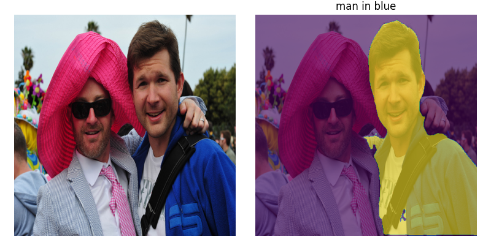

# *Segment*, *Select*, *Correct*: A Framework for Weakly-Supervised Referring Image Segmentation


This is the official repo for the paper [*Segment*, *Select*, *Correct*: A Framework for Weakly-Supervised Referring Image Segmentation](https://arxiv.org/abs/2310.13479) or S+S+C for short (`ssc` in code). This repository is licensed under a GNU general public license (find more in LICENSE.txt).


## Getting Started

To perform inference or run Stages 1, 2 or 3, you must first perform the basic setup. Start by cloning this GitHub repo:
```
git clone https://github.com/fgirbal/segment-select-correct.git
cd segment-select-correct
```

You can now install the package and its requirements. Given the outside package dependencies, it is highly recommended that you do this in a separate virtual/conda environment. To create and activate a new Conda environment that supports this execute:
```
conda create -n ssc_ris python=3.7 -y
conda activate ssc_ris
```

The main package installation should be done with (omit `-e` if you do not want to edit the package, though that might cause some file system issues when installing the steps below):
```
pip install torch==1.8.1+cu111 torchvision==0.9.1+cu111 -f https://download.pytorch.org/whl/torch_stable.html
pip install -r requirements.txt
pip install -e .
```

Follow the appropriate instructions below to run inference or run Stages 1, 2, or 3.

## Inference Demo on Example Images

To simply test our pre-trained models (`S+S+C` in the paper) by running inference on images, you can download their weights [here](https://drive.google.com/drive/folders/1FHbcVz-HfseheGcRo0SiD3Bq0FDGMqVz), or for the individual models:

| [RefCOCO](https://drive.google.com/file/d/1ZDXktKvNdai-2IPqhzeu5gC9Y1oKilsW/view) | [RefCOCO+](https://drive.google.com/file/d/1vQX2q11C2YK3OQMYFYiCIzzsrUYE5744/view) | [RefCOCOg (U)](https://drive.google.com/file/d/1YB_dDMhpTL541BobN-jKd1ie6enKNHY_/view) | [RefCOCOg (G)](https://drive.google.com/file/d/1ASvev63wODZLQ4xxg7v6z4lebW2opV_G/view) | 
|---|---|---|---|

To perform inference on example images from the `examples` folder (or others in your machine), from the main directory simply run for example:
```
python examples/inference_demo.py --model-checkpoint [PATH_TO_MODEL_CHECKPOINT] --sentence "man in blue" --input-image examples/image_1.jpg
```
which, given the RefCOCO corrected model from above should generate the following output:


## Running Stages 1, 2 and 3

To use this package with RefCOCO, RefCOCO+ or RefCOCOg, you must:
- Follow instructions from [the LAVT repository](https://github.com/yz93/LAVT-RIS/tree/main/refer) to set up subdirectories and download annotations. The API itself is inside the `ssc` package (`ssc_ris.refer_dataset`), so you can setup the data there or anywhere else in your machine. 
- [Download images from COCO](https://cocodataset.org/#download) (the link entitled 2014 Train images [83K/13GB]), extract them from the ZIP to a folder `[REFER_DATASET_ROOT]/images/mscoco/images`, where `[REFER_DATASET_ROOT]` is a pointer to the `data` folder of Refer as per the instructions in the previous point.

If you want to run the `Segment` step (Stage 1) of our framework to generate all the instance segmentation masks, you must also download the spaCy dictionary, install GroundingDINO and download the relevant weights. Follow steps 1., 2. and 3. to do that. 

If you want to train models from the `Correct` step (Stage 3), then you must download the Swin transformer pre-trained weights. Follow steps 4. to do that.

If you want to perform inference using our pre-trained models, you can download the pre-trained weights from running all stages. Follow steps 5. to do that.

### 1. (Stage 1) Download spaCy dictionary
```
python -m spacy download en_core_web_md
```

### 2. (Stage 1) Installing GroundingDINO and downloading the weights:

Clone and install GroundingDINO by running:
```
git clone https://github.com/IDEA-Research/GroundingDINO.git
cd GroundingDINO

# for reproducibility of our results, checkout this commit
git checkout 57535c5a79791cb76e36fdb64975271354f10251
pip install -e .
```

Download relevant weights and return to the `scripts` folder:
```
mkdir weights
cd weights
wget https://github.com/IDEA-Research/GroundingDINO/releases/download/v0.1.0-alpha/groundingdino_swint_ogc.pth
cd ../..
```

### 3. (Stage 1) Downloading the SAM weights:

Making sure you are in within `scripts` folder, execute:
```
mkdir sam_weights
cd sam_weights
wget https://dl.fbaipublicfiles.com/segment_anything/sam_vit_h_4b8939.pth
```

### 4. (Stage 3) Download Swin transformer weights
Inside the `scripts` folder, execute:
```
mkdir train/swin_pretrained_weights
cd train/swin_pretrained_weights
wget https://github.com/SwinTransformer/storage/releases/download/v1.0.0/swin_base_patch4_window12_384_22k.pth
```

## 2. *Segment*: Generating all the masks

To run the first stage of our framework for the RefCOCO training set, move to the `scripts` folder and execute:
```
python create_all_masks_dataset.py -n example -d refcoco --dataset-root [REFER_DATASET_ROOT] --most-likely-noun --project --context-projections -f
```
where `[REFER_DATASET_ROOT]` is the pointer to the folder `data` of the REFER. This will create an `example` folder inside `segment_stage_masks` which can be used in the next step.

For help with this script execute `python create_all_masks_dataset.py --help`.

## 3. *Select*: Zero-shot instance choice

To run the second stage of our framework for the RefCOCO training set on the `example` masks generated in 2.2. still inside the `scripts` folder execute:
```
python create_zero_shot_masks_dataset.py --original-name example --new-name example_selected --dataset-root [REFER_DATASET_ROOT] --mask-choice reverse_blur -f
```
This will create an `example_selected` folder inside `select_stage_masks` which can be used for training.

For help with this script execute `python create_zero_shot_masks_dataset.py --help`.

## 4. Testing unsupervised masks

To test the quality of the masks generated in 2.2. (or 2.3.), run the following script:
```
python test_unsupervised_masks_dataset.py -n example -s segment --dataset-root [REFER_DATASET_ROOT] --mask-choice reverse_blur -f
```
This will test all of the masks generated in 2.2. using the reverse blur zero-shot choice criteria. Other options for `mask-choice` include `random` (to choose a random mask) or `best` (to pick the one that maximizes mean intersection over union). Testing the select stage masks can be done by replacing the name with the experiment one (e.g., `example_selected`) and modifying `-s select` to identify the stage. Note that `mask-choice` won't influence the outcome in that case, since each mask only has one option (the previously chosen one by the select stage mechanism).

For help with this script execute `python test_unsupervised_masks_dataset.py --help`.

## 5. Pre-training or constrained greedy matching

To pre-train a model using the zero-shot selected masks from `example_selected` in 2.2., run the following script from inside the `scripts/train`:
```
python -m torch.distributed.launch --nproc_per_node 4 --master_port 12345 train_model.py \
    --dataset refcoco --model_id refcoco \
    --batch-size 7 --batch-size-unfolded-limit 15 --lr 0.00005 --wd 1e-2 --epochs 40 --img_size 480 \
    --swin_type base --pretrained_swin_weights swin_pretrained_weights/swin_base_patch4_window12_384_22k.pth \
    --refer_data_root [REFER_DATASET_ROOT] --pseudo_masks_root ../select_stage_masks/example_selected/instance_masks/ \
    --model-experiment-name test_experiment --one-sentence --loss-mode random_ce
```
Note that the total batch size in this case will be 60. 

Once this model is trained (the output will be inside the `models` folder and this case it will be called `test_example_best_refcoco.pth`), we can do 40 epochs of constrained greedy matching on the `segment_stage_masks` of `example` by running:
```
python -m torch.distributed.launch --nproc_per_node 4 --master_port 12345 train_model.py \
    --dataset refcoco --model_id refcoco \
    --batch-size 7 --batch-size-unfolded-limit 15 --lr 0.00005 --wd 1e-2 --epochs 40 --img_size 480 \
    --swin_type base --pretrained_swin_weights swin_pretrained_weights/swin_base_patch4_window12_384_22k.pth \
    --refer_data_root [REFER_DATASET_ROOT] --pseudo_masks_root ../segment_stage_masks/example/instance_masks/ \
    --model-experiment-name test_experiment_greedy --one-sentence --loss-mode greedy_ce
    --init-from models/refcoco/test_example_best_refcoco.pth
```
The only changes between this script and the previous one is that this one includes an `--init-from` option to initialize the model, the `--pseudo_masks_root` come from the segment stage instead of the select stage, and `--loss-mode` is now `greedy_ce` instead of `random_ce` (which is effectively using the only mask in the zero-shot choosen masks).

For more help with this script execute `python train_model.py --help`.

## 6. Testing a trained model

To test a trained model on the validation split of RefCOCO, run the following script from inside the `scripts/train`:
```
python test_model.py --dataset refcoco --split val --model_id refcoco \
    --workers 4 --swin_type base --img_size 480 \
    --refer_data_root [REFER_DATASET_ROOT] --ddp_trained_weights \
    --window12 --resume models/refcoco/test_example_best_refcoco.pth
```
for the pre-trained model from 2.5., or change `--resume` to `models/refcoco/test_example_greedy_best_refcoco.pth` to test the constrained greedy trained one.

For more help with this script execute `python test_model.py --help`.

## Citation and Acknowledgements

If you use `ssc` in your work, please cite the following:
```
@misc{eiras2023segment,
      title={Segment, Select, Correct: A Framework for Weakly-Supervised Referring Segmentation}, 
      author={Francisco Eiras and Kemal Oksuz and Adel Bibi and Philip H. S. Torr and Puneet K. Dokania},
      year={2023},
      eprint={2310.13479},
      archivePrefix={arXiv},
      primaryClass={cs.CV}
}
```

This work was supported by the EPSRC Centre for Doctoral Training in Autonomous Intelligent Machines and Systems [EP/S024050/1], by Five AI Limited, by the UKRI grant: Turing AI Fellowship EP/W002981/1, and by the Royal Academy of Engineering under the Research Chair and Senior Research Fellowships scheme.